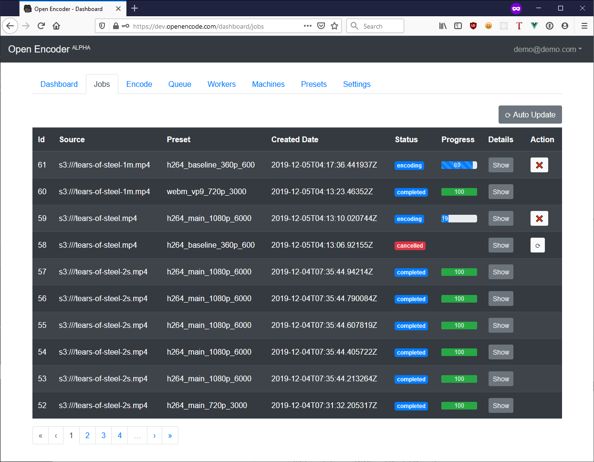

<div align="center">
    <h1><code>openencoder</code></h1>
    <p><strong>Open Source Cloud Encoder for FFmpeg</strong></p>
    <p>A distributed and scalable video encoding pipeline to be used
    as an API or web interface using your own hosted or cloud infrastructure
    and FFmpeg encoding presets.
    </p>
    <p>⚠️ Currently functional, but a work-in-progress! Check back for updates!</p>
    <p>
        <a href="https://travis-ci.org/alfg/openencoder">
          
        </a>
        <a href="https://godoc.org/github.com/alfg/openencoder">
          
        </a>
        <a href="https://goreportcard.com/report/github.com/alfg/openencoder">
          
        </a>
        <a href="https://hub.docker.com/r/alfg/openencoder/builds">
          
        </a>
        <a href="https://hub.docker.com/r/alfg/openencoder">
          
        </a>
    </p>
</div>


## Features
* HTTP API for submitting jobs to a redis-backed FFmpeg worker
* FTP and S3 storage (AWS, Digital Ocean Spaces and Custom S3 Providers supported)
* Web Dashboard UI for managing encode jobs, workers, users and settings
* Machines UI/API for scaling cloud worker instances in a VPC
* Database stored FFmpeg encoding presets
* User accounts and roles


## Preview
    


## Development

#### Requirements
* Docker
* Go 1.11+
* NodeJS 8+ (For web dashboard)
* FFmpeg
* Postgres
* S3 API Credentials & Bucket (AWS or Digital Ocean)
* Digital Ocean API Key (only required for Machines API)

Docker is optional, but highly recommended for this setup. This guide assumes you are using Docker.


#### Setup
* Start Redis and Postgres in Docker:
```
docker-compose up -d redis
docker-compose up -d db
```

When the database container runs for the first time, it will create a persistent volume as `/var/lib/postgresql/data`. It will also run the scripts in `scripts/` to create the database, schema, settings, presets, and an admin user.

* Build & start API server:
```
go build -v && ./openencoder server
```

* Start the worker:
```
./openencoder worker
```

* Start Web Dashboard for development:
```
cd static && npm run serve
```

* Open `http://localhost:8081/dashboard` in the browser and login with `admin/password`.


See [Quick-Setup-Guide](https://github.com/alfg/openencoder/wiki/Quick-Setup-Guide-%5Bfor-development%5D) for full development setup guide.

## API
See: [API.md](/API.md)


## Scaling
You can scale workers by adding more machines via the Web UI or API.

Currently only `Digital Ocean` is supported. More providers are planned.

See: [API.md](/API.md) for Machines API documentation.


## Documentation
See: [wiki](https://github.com/alfg/openencoder/wiki) for more documentation.


## Roadmap
See: [Development Project](https://github.com/alfg/openencoder/projects/1) for current development tasks and status.


## License
MIT
